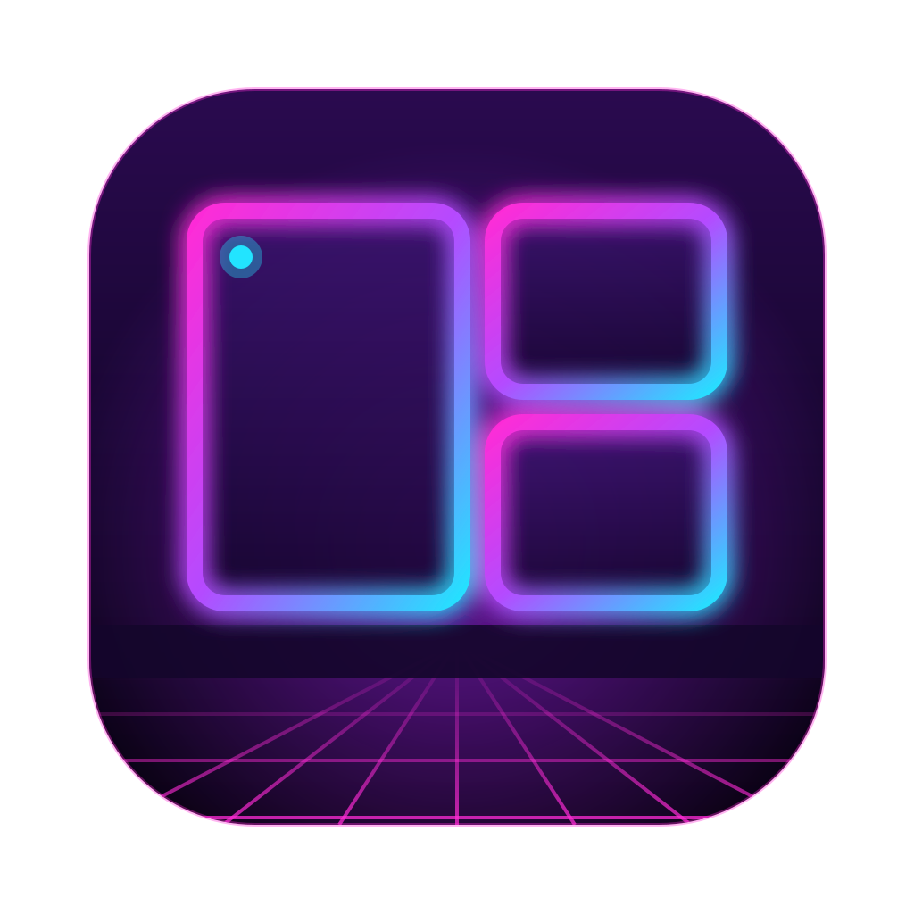

<p align="center">
  
</p>

<h1 align="center">HyprDarwin</h1>

<p align="center">
  <b>Hyprland for macOS</b>: tiling, a status bar, window borders and plugins in one app.<br>
  <a href="https://github.com/juniorsaldanha/hyprland-darwin/actions/workflows/ci.yml"></a>
  <a href="https://github.com/juniorsaldanha/hyprland-darwin/releases/latest"></a>
  <a href="LICENSE.txt"></a>
  <br>
  <a href="https://juniorsaldanha.github.io/hyprland-darwin/">Website</a> ·
  <a href="#install">Install</a> ·
  <a href="#configuration">Configuration</a> ·
  <a href="#plugins">Plugins</a>
</p>

HyprDarwin is a fork of [AeroSpace](https://github.com/nikitabobko/AeroSpace) that replaces a whole stack of
separate tools with one app. You no longer need AeroSpace or Hyprspace plus SketchyBar, JankyBorders and a folder of
scripts.

| | |
|---|---|
| **Tiling** | AeroSpace's tree tiling, workspaces and multi-monitor support. Hyprland-style keybinds on `alt`. No SIP changes. |
| **Status bar** | One bar per screen: workspaces, the front app, and widgets for CPU, RAM, GPU, disk, network, volume, battery and clock. Auto-hide, and a notch panel. |
| **Borders** | A gradient ring around the focused window and a dim ring around the others. |
| **Plugins** | Any executable that speaks JSON lines over stdin/stdout can be a bar widget, react to events, or run commands. |
| **Mouse** | Focus follows the mouse, and `alt` + drag moves a window. |
| **Setup** | `hypr init` applies the macOS settings it needs (with a backup and undo) and writes a starter config. A Permissions window walks you through Accessibility. |

## Install

### Homebrew

```sh
brew tap juniorsaldanha/hyprland-darwin https://github.com/juniorsaldanha/hyprland-darwin
brew install --cask hyprdarwin
```

This installs `HyprDarwin.app`, the `hypr` CLI, shell completion for zsh, bash and fish, and man pages
(`man hypr`, `man hypr-workspace`, …). Upgrade with `brew upgrade --cask hyprdarwin`.

> [!NOTE]
> Releases are signed ad hoc, not with an Apple Developer ID. The cask removes the quarantine flag so macOS will open
> the app. Because of the ad-hoc signature, macOS asks for Accessibility permission again after every upgrade.

### From source

Requires Xcode and Swift 6.4.

```sh
git clone https://github.com/juniorsaldanha/hyprland-darwin && cd hyprland-darwin
make app-install   # HyprDarwin.app → /Applications, CLI → ~/.local/bin/hypr
```

`make app-install` signs with a self-signed certificate called `hyprdarwin-codesign-certificate`, so the Accessibility
permission survives rebuilds. Create it once in Keychain Access → Certificate Assistant → Create a Certificate…
(Self Signed Root, Code Signing). Or build ad hoc with `HYPRDARWIN_CODESIGN_IDENTITY=- make app-install`.

## First run

```sh
hypr init                    # macOS settings (backed up) + starter config
open -a HyprDarwin           # grant Accessibility when the Permissions window asks
```

- `hypr init` makes displays share one Space (after you log out), groups windows by app in Mission Control, turns off
  the window-open animation, and hides the macOS menu bar so the HyprDarwin bar replaces it. It saves the previous
  values first.
- `hypr init --undo` restores the settings from before your first `hypr init`.
- `hypr init --wallpaper ~/Pictures/wall.jpg` also sets the wallpaper on every screen.
- The starter config goes to `~/.config/hyprland-darwin/config.toml`. An existing config is never overwritten.

## Configuration

The config is `~/.config/hyprland-darwin/config.toml` (or `$XDG_CONFIG_HOME/hyprland-darwin/config.toml`). It uses
AeroSpace's TOML format plus the sections below, and reloads automatically when you save it.

### Default keybinds

The mod key is `alt`, standing in for Hyprland's `SUPER`.

| Keys | Action |
|---|---|
| `alt` + `h` `j` `k` `l` | Focus left / down / up / right |
| `alt` + `shift` + `h` `j` `k` `l` | Move the window |
| `alt` + `1`…`0` | Go to workspace 1…10 |
| `alt` + `shift` + `1`…`0` | Move the window to workspace 1…10 |
| `alt` + `s` / `alt` + `shift` + `s` | Scratchpad workspace (Hyprland's special workspace) |
| `alt` + `enter` / `b` / `e` | Open or focus Terminal / Safari / Finder |
| `alt` + `f` / `alt` + `v` | Fullscreen / toggle floating |
| `alt` + `/` / `alt` + `,` | Tiles / accordion layout |
| `alt` + `-` / `alt` + `=` | Resize |
| `alt` + `r` | Resize mode (`h` `j` `k` `l`, `esc` to leave) |
| `alt` + `tab` | Previous workspace |
| `alt` + drag | Move a window with the mouse |

Every AeroSpace command works in bindings and through the CLI (`hypr <command>`). See the
[AeroSpace command reference](https://nikitabobko.github.io/AeroSpace/commands).

### Bar

```toml
[bar]
    enabled = true
    left = ['workspaces', 'chevron', 'front-app']
    center = []
    right = ['disk', 'ram', 'gpu', 'cpu', 'network', 'volume', 'battery', 'clock']
    workspaces = 'all'      # 'visible': only the workspace on each monitor, e.g. 1 │ 2
    height = 40             # 16–100
    color = '0x40000000'    # tint over the blur, 0xAARRGGBB
    blur = true
    font = 'Hack Nerd Font' # bundled with the app
    icon-size = 17
    label-size = 14
    foreground = '0xe1e1e1e1'
    auto-hide = true        # hides while the mouse is at the top edge, for apps' own menus

[notch]
    items = ['clock']       # widgets in a panel under the notch (MacBooks with a notch)
```

`workspaces`, `chevron` and `front-app` are built in. Every other name is a [plugin](#plugins). Click a workspace to
go to it. Click a widget to send it a `click` event, or to open its popup menu.

### Borders

```toml
[borders]
    enabled = true
    width = 5
    radius = 10
    active = 'gradient(0xff7aa2f7,0xffbb9af7)'
    inactive = '0x80414868'
```

### Mouse

```toml
[focus-follows-mouse]
    enabled = true

[mouse-drag]
    enabled = true
    modifier = 'alt'
```

## Plugins

A plugin is a folder holding a `plugin.toml` and an executable. HyprDarwin looks in
`~/.config/hyprland-darwin/plugins/<name>/`, then in the plugins bundled with the app. Put the name in a `[bar]` or
`[notch]` list to place it.

```toml
# plugin.toml
api = 1
exec = "./run.sh"
mode = "interval"           # or "stream"
interval = 5                # seconds, interval mode only
events = ["workspace"]      # workspace, focus, monitor, wake, click, power, volume
```

- **`interval` mode:** the executable runs every `interval` seconds and on each subscribed event, and prints one
  update. The event comes in `HYPR_EVENT`, `HYPR_EVENT_JSON` and, for clicks, `HYPR_BUTTON`.
- **`stream` mode:** the executable stays running, reads one JSON event per line on stdin, and prints updates whenever
  it likes. It must exit when stdin closes.

Each line it prints is JSON:

```json
{"icon": "", "label": "12%", "color": "0xffe1e1e1", "icon_color": "0xffbb9af7", "background": "0x40000000"}
{"hidden": true}
{"popup": [{"label": "Open Activity Monitor", "run": "exec-and-forget open -a 'Activity Monitor'"}]}
{"run": "workspace 2"}
```

- A line is a partial update and is merged into the widget's current state.
- `run` executes any HyprDarwin command.
- Plugins get `HYPR_PLUGIN_NAME` and `HYPR_PLUGIN_DIR` in their environment.
- A stream plugin that crashes is restarted with backoff. After 5 crashes within 60 s it stops until the next reload.

`hypr list-plugins` shows each plugin's status. Logs are in `~/Library/Logs/hyprland-darwin/<plugin>.log`. To start
your own plugin, copy [`bundled-plugins/example`](bundled-plugins/example).

## CLI

`hypr` is AeroSpace's CLI plus a few HyprDarwin commands:

| Command | What it does |
|---|---|
| `hypr init [--undo] [--wallpaper <path>]` | Set up macOS and write a starter config |
| `hypr list-plugins [--json]` | Plugin status and the latest widget state |
| `hypr workspace 3`, `hypr list-windows --all`, … | [Every AeroSpace command](https://nikitabobko.github.io/AeroSpace/commands) |

## Troubleshooting

- **Nothing tiles:** check System Settings → Privacy & Security → Accessibility. After an upgrade, remove HyprDarwin
  from the list and add it again.
- **A widget shows ⚠:** click it to see why, and check `hypr list-plugins` and `~/Library/Logs/hyprland-darwin/`.
- **The app log** is `~/Library/Logs/hyprland-darwin/hyprdarwin.log`.

## Development

| Command | What it does |
|---|---|
| `make build` | Debug build, warnings as errors |
| `make test-unit` | Unit tests (every XCTest class except `*IntegrationTest`) |
| `make test-integration` | `*IntegrationTest` classes plus checks on the real CLI binary |
| `make lint` | swiftformat, swiftlint, periphery |
| `make app` / `make app-install` | Release build in `.release/` / and install it |
| `make ci` | Everything the CI `test` and `lint` jobs run |

- **Unit tests** live in `Sources/AppBundleTests/`.
- **Integration tests** cross a real boundary: a file, a process, the CLI binary or the app bundle. Name their
  classes `*IntegrationTest`.
- **Design docs** are in [`docs/superpowers/specs/`](docs/superpowers/specs/).

### CI and releases

| Workflow | When it runs | What it does |
|---|---|---|
| [`ci.yml`](.github/workflows/ci.yml) | Push to `main`, pull requests | Tests on macOS 15 and 27, lint, and an app build uploaded as an artifact |
| [`release.yml`](.github/workflows/release.yml) | Tag `v*` | Tests, builds the app with that version, publishes the GitHub release and updates [`Casks/hyprdarwin.rb`](Casks) |
| [`pages.yml`](.github/workflows/pages.yml) | Changes to `site/` | Deploys the website to GitHub Pages |

To release:

```sh
git tag v0.2.0 && git push origin v0.2.0
```

The website is the static page in [`site/`](site). To use a custom domain, add a `site/CNAME` file containing the
domain and point its DNS at GitHub Pages.

## Credits

- **[AeroSpace](https://github.com/nikitabobko/AeroSpace)** by Nikita Bobko: the tiling core. MIT, see
  [`LICENSE.txt`](LICENSE.txt).
- **Ideas** from [Hyprland](https://hypr.land), [Hyprspace](https://hyprspace.net),
  [SketchyBar](https://github.com/FelixKratz/SketchyBar) and [JankyBorders](https://github.com/FelixKratz/JankyBorders).
- **[Hack Nerd Font](https://www.nerdfonts.com)** is bundled for the bar's icons. Its licence is in
  [`bundled-fonts/LICENSE.md`](bundled-fonts/LICENSE.md).
